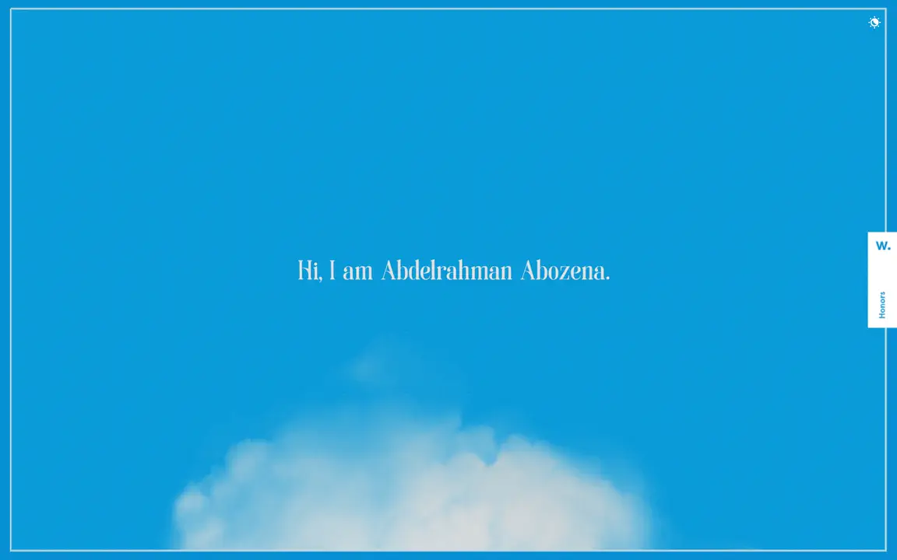

  

  AI &amp; data science engineer building thoughtful products, intelligent systems, and immersive interfaces.

  

  <a href="https://abdoabozena7.github.io/3d_scroll_portoflio/">Interactive version ↗</a>

  
  
  

  

